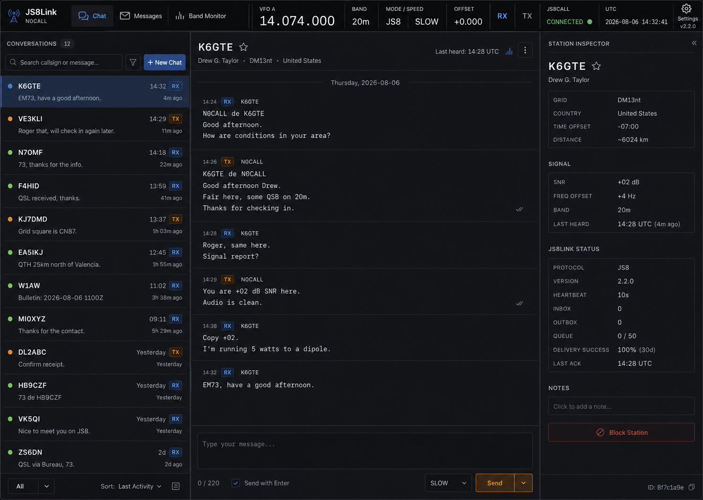
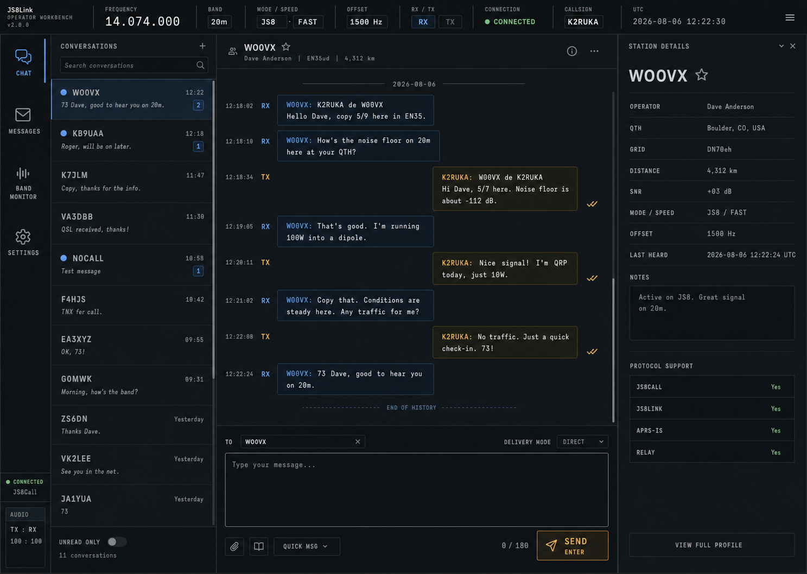

# JS8Link Station Console style guide

Deze style guide is de vaste visuele en interactionele basis voor JS8Link. Nieuwe schermen en
uitbreidingen moeten hierop voortbouwen. Het doel is een professionele HamRadio-console: compact,
informatierijk en operationeel, zonder de uitstraling van een generieke website.

## Ontwerpprincipes

1. **Radio-instrument, geen website.** De applicatie vult de viewport. Functies staan in vaste
   werkpanelen met dunne scheidingslijnen; er is geen gecentreerde pagina met losse kaarten.
2. **Telemetrie is altijd scanbaar.** Frequentie, band, mode, offset, RX/TX, verbinding en UTC staan
   samen in de stationbalk en gebruiken tabulaire cijfers.
3. **Informatiedicht, maar rustig.** Kleine tussenruimtes, compacte bediening en duidelijke
   hiërarchie. Kleur wordt uitsluitend voor betekenis gebruikt.
4. **Desktop-first, volledig responsive.** Op kleinere schermen verdwijnt geen functionaliteit:
   secundaire informatie verhuist naar een detaildialoog en lijst/detail-schermen worden na elkaar
   getoond.
5. **Dark en light zijn gelijkwaardig.** Beide thema's gebruiken dezelfde hiërarchie, afmetingen en
   semantische kleuren. Een component mag niet alleen in één thema worden ontworpen.

## Visuele referenties

De onderstaande ontwerpbeelden horen bij deze style guide en zijn normatieve visuele referenties.
Gebruik ze bij iedere uitbreiding naast de geschreven regels. Ze bepalen compositie,
informatiedichtheid, typografie, kleurhiërarchie, iconografie en de uitstraling van radio-
instrumenten. De getoonde callsigns en waarden zijn voorbeelddata en mogen niet als functionele
defaults worden overgenomen.

Als referenties onderling verschillen, geldt deze volgorde:

1. gebruik het beeld van het scherm waaraan wordt gewerkt;
2. volg daarna de geschreven regels in deze style guide;
3. gebruik het andere beeld alleen voor aanvullende componentdetails.

### Chat — primaire Station Console

Primaire referentie voor de applicatieschil, stationbalk, navigatie, gesprekkenlijst, compacte
radiolog en stationinspecteur.

### Chat — Operator Workbench-detaillering

Aanvullende referentie voor technische typografie, compacte bedieningsvelden, RX/TX-kleurgebruik,
statusregels, composerbediening en de hogere informatiedichtheid van een radioapplicatie.

### Bandmonitor — Station Console

Primaire referentie voor de bandscope, kaart, stations en verbindingen, filters, monitor-tabellen,
SNR-kleuren en gecombineerde kaart-/verkeerswerkruimte.

## Design tokens

Gebruik uitsluitend de CSS custom properties uit `frontend/src/index.css` en
`frontend/src/precision.css`. Voeg een token toe als
een nieuwe gedeelde betekenis nodig is; plaats geen losse hex-kleuren in component-specifieke CSS.

| Betekenis | Dark | Light |
|---|---:|---:|
| App-achtergrond | `#090c10` | `#edf1f5` |
| Paneel | `#0f1318` | `#ffffff` |
| Verhoogd paneel / invoer | `#151a20` | `#f7f9fb` |
| Hover / selectie | `#1b2430` | `#e7eef6` |
| Scheidingslijn | `#27313b` | `#cbd3dc` |
| Primaire tekst | `#e6ebf1` | `#17202a` |
| Secundaire tekst | `#8f9aa7` | `#596573` |
| RX / interactief blauw | `#4b9eff` | `#1269c7` |
| TX / waarschuwing amber | `#f3a11a` | `#a95a00` |
| Verbonden groen | `#62c277` | `#247b3c` |
| Fout rood | `#f06464` | `#b4232c` |

### Forest Console-thema

Het Forest Console-thema (`data-theme="forest"`) is de aardse alternatieve donkere variant. Gebruik
een bijna zwarte groenbasis (`#0b110e`), mos-/lichen-groen voor RX en verbonden status, kleioranje
(`--console-tx`) voor TX en een warme zandkleur voor primaire tekst. Het thema behoudt exact dezelfde
layout, dichtheid, radiobetekenissen en responsive gedrag als Dark en Light. Voeg geen gradients,
glassmorphism of decoratieve kleurvlakken toe; kleur blijft betekenisvol en operationeel.

Het Field Light-thema (`data-theme="field-light"`) is de lichte tegenhanger van dezelfde stijl. Het
gebruikt warme ivoor-/linnenoppervlakken, olijfgroen voor RX en verbonden status, en terracotta voor
TX en primaire verzendacties. Tekst en scheidingslijnen blijven warm donkerbruin in plaats van puur
zwart. De informatiehiërarchie, compacte instrumentbalk en responsive panelen zijn identiek aan de
andere thema's.

Standaard radius is `3px`; grote panelen mogen maximaal `6px` gebruiken. Schaduwen zijn alleen
toegestaan voor modals, popovers en zwevende kaartinformatie. Gebruik geen gradients.

## Typografie

- Interface: lokaal meegeleverde `IBM Plex Sans`, daarna de lokale system sans-serif stack.
- Frequenties, offsets, tijden, callsigns, radiologregels en meetwaarden: lokaal meegeleverde
  `IBM Plex Mono` via `var(--font-data)`, altijd met tabulaire cijfers.
- Basistekst: 13px. Paneeltitels: 12px, semibold, uppercase met beperkte letterspacing.
- Grote VFO-weergave: 22–30px op desktop en minimaal 17px op mobiel. Gebruik gewicht 400 en een
  kleine positieve letterspacing, zodat de uitlezing de rustige optiek van een echt radiodisplay
  houdt.
- Gebruik geen decoratieve displayfonts en laad geen fonts via een CDN.

## Applicatieschil en stationbalk

De stationbalk staat bovenaan, is vlak en heeft een onderrand. Van links naar rechts:

1. JS8Link-merk, huidig station en klikbaar versienummer;
2. primaire navigatie;
3. VFO-frequentie en band;
4. JS8-mode en transmissiesnelheid;
5. offset en auto/vast-status;
6. RX/TX-activiteit, JS8Call-verbinding en UTC;
7. instellingen.

Instrumentgroepen hebben geen kaartschaduw of ronde capsule. Ze worden met verticale lijnen van
elkaar gescheiden. RX is blauw, TX is amber en verbinding is groen. Elke kleurstatus heeft ook een
tekstlabel of toegankelijk label.

### Radiodeck en bandscope

- De VFO-uitlezing is het visuele zwaartepunt van de stationbalk: label `VFO A` bovenaan en de
  frequentie als `14.074.000`, nooit als klein formuliergetal.
- `BAND`, `MODE / SPEED`, `OFFSET`, `RX`, `TX`, `JS8CALL` en `UTC` zijn afzonderlijke
  instrumentcellen. RX en TX mogen niet in één generieke verbindingsindicator worden samengevoegd.
- RX gebruikt een neerwaarts ontvangsticoon en blauw; TX gebruikt een opwaarts zendicoon en amber.
  Alleen de actuele toestand krijgt een gekleurde onderlijn en achtergrondtint.
- Direct onder de stationbalk staat een compacte bandscope van circa 38px hoog. Dit is een echte
  datavisualisatie op basis van recente ontvangen en verzonden verkeersitems, geen decoratieve
  illustratie.
- De scope toont minimaal 500–2500 Hz, met een subtiel groen heartbeatgebied van 500–1000 Hz en een
  subtiel blauw JS8-passbandgebied van 1000–2500 Hz. Ticklabels zijn monospaced.
- Ontvangen signalen zijn blauw, goede SNR groen, zeer zwakke SNR rood en eigen TX-verkeer amber.
  De ingestelde offset is een dunne gestippelde amberkleurige marker.
- De scope wordt standaard uit een sliding window van 15 minuten gevuld en ververst bij live
  bandverkeer en periodiek. Lege data blijft een rustige schaal; er worden nooit fictieve pieken
  getekend.

## Werkpanelen

- Panelen sluiten direct op elkaar aan en gebruiken `1px` scheidingslijnen.
- Headers zijn 40–56px hoog en bevatten titel, context en de primaire lokale acties.
- Tabellen gebruiken sticky headers, compacte rijen en monospaced meetwaarden.
- Chat gebruikt op brede schermen drie kolommen: gesprekken, transcript en stationinspecteur.
- De stationinspecteur groepeert identiteit, signaal, protocolstatus en aantekeningen.
- Chatberichten zijn compacte radiologregels over de volle transcriptbreedte. Gebruik geen grote
  ronde chatballonnen: richting staat in een RX- of TX-badge, gevolgd door callsign, tekst en een
  monospaced metadataregel.
- Formulieren gebruiken sectiekoppen en rijen; vermijd één grote stapel zwevende kaarten.
- ShadCN/UI-primitives blijven de basis voor Button, Input, Select, Switch, Tabs, Dialog en
  Textarea. Styling loopt altijd via de gedeelde tokens en componentklassen.

## Vaste detaillering per scherm

De onderstaande regels zijn normatief. Een nieuw scherm mag de inhoud aanpassen, maar niet opnieuw
een eigen visuele grammatica introduceren.

### Paneel- en werkruimteheaders

- Iedere hoofdwerkruimte begint met een header van 58–72px hoog met een onderrand van 1px.
- Links staan een semantisch icoon in RX-blauw, een uppercase `panel-eyebrow`, de schermtitel in de
  datastack en maximaal één korte toelichtingsregel.
- Rechts staan alleen live meetwaarden, lokale filters of de primaire schermactie. Gebruik daarvoor
  naast elkaar liggende instrumentcellen met verticale scheidingslijnen.
- Een meetwaardecel heeft een uppercase label van 8px, een monospaced waarde van 14–18px en eventueel
  een secundaire regel van 9px. Er is geen kaartschaduw of capsulevorm.

### Bandmonitor

- De bovenste commandobalk bevat titel, aantallen verkeersitems/stations/relaties en de gedeelde
  band- en historiefilters.
- De kaart en het onderpaneel raken elkaar; alleen de horizontale resizebalk van 12px scheidt ze.
- De kaartheader bevat stations- en relatieaantallen en een SNR-schaal: rood (`-20`), amber (`-7`),
  groen (`0`) en blauw (`+10 dB`).
- Iedere verbindingshelft met een bekende ontvangst-SNR gebruikt de bijbehorende SNR-kleur. Een
  helft zonder bekende ontvangst-SNR blijft altijd zichtbaar als een contrastrijke lichte
  stippellijn met donkere onderlijn; dit geldt ook voor gegroepeerde verbindingen.
- OpenStreetMap-tegels worden in dark mode gedimd en minder verzadigd. In light mode blijven ze op
  normale helderheid. Markers, popovers en bediening blijven onaangetast.
- Kaartweergavekeuze staat linksboven als compacte tabgroep. Legenda staat in een vaste balk onder de
  kaart en gebruikt iconen, geen zelfgetekende stippen of lijnen.
- Het onderste paneel gebruikt één gedeelde header voor `Verkeer`, `Per offset` en `Laatst gehoord`.
  Tabellen gebruiken 8px uppercase headers, monospaced 11px-data en afwisselend zeer subtiele rijen.
- RX is blauw, TX amber, afgeleide callsigns amber en kritieke/foutstatus rood. Offsetgroepen hebben
  een blauw getinte groepsrij en worden nooit als losse kaarten weergegeven.

### Instellingen

- De instellingenwerkruimte heeft een eigen titelheader, verbindingstatus en vaste tabstrip voor
  `Applicatie` en `JS8Call`.
- Applicatie-instellingen worden verdeeld in genummerde consolepanelen:
  `01 Interface`, `02 Verbinding` en `03 Onderhoud`.
- Ieder paneel heeft een 44–56px sectieheader met icoon, eyebrow, titel en korte context. Velden staan
  in een responsive grid: twee kolommen op desktop, één kolom op mobiel.
- Switch-instellingen zijn een volledige rij met icoon en uitleg links en de Switch rechts.
- Live status wordt als meetwaardecel weergegeven, bijvoorbeeld API-status met host en poort.
- Opslaan staat in een sticky onderbalk. Op mobiel vult de primaire knop de volledige breedte.
- JS8Call-instellingen gebruiken drie datakolommen op breed desktop, twee op tablet en één op
  mobiel. Groepskoppen (`Station`, `Radio en mode`, `Rapportage`) lopen over de volledige breedte.

### Berichten-placeholder en toekomstige berichtenwerkruimte

- Ook een lege of toekomstige functie behoudt de volledige consoleheader.
- Rechts in de header staan voorbereidende Inbox-, Outbox- en TX-queuecellen. Onbekende waarden zijn
  `--`; verzin geen echte aantallen.
- De lege toestand staat gecentreerd in het resterende paneel en toont maximaal één pictogram,
  statuslabel, titel, uitleg en een compacte functiestrook.

### Modals en bevestigingen

- Desktopbreedte is standaard 620px; een changelog mag 760px zijn. Radius is maximaal 3px.
- De modal heeft een 3px blauwe binnenaccentlijn links, een header van minimaal 70px, een inhoudsvlak
  en een vaste actiebalk onderaan. Alleen de modal werpt een schaduw.
- De sluitactie gebruikt een icoonbutton van 36x36px. Gebruik nooit `×`, pijlen of emoji als glyph.
- Titel staat in de monospaced datastack. Subtekst is 10px muted. Formuliervelden zijn minimaal 38px
  hoog en gebruiken monospaced invoer waar het callsigns, frequenties of technische data betreft.
- Op mobiel wordt een modal een bottom sheet met 8px buitenruimte en maximaal `100dvh - 16px` hoog.
  Inhoud scrolt binnen de sheet; de pagina erachter blijft vast.
- Update-, waarschuwing- en foutmodals gebruiken respectievelijk RX-blauw, TX-amber en rood voor het
  statusaccent. Kleur is altijd gecombineerd met tekst.

### Setupwizard en login

- Setup en login gebruiken dezelfde consoleachtergrond en een compacte merkbalk.
- De wizardstappen vormen één aaneengesloten instrumentstrip; actieve stappen hebben een blauwe
  ondertoon en vierkante nummerindicator.
- Het wizardpaneel is vlak, maximaal 920px breed en heeft geen grote afgeronde marketingkaart.
- Login is maximaal 430px breed, heeft het blauwe linkeraccent en gebruikt dezelfde veld- en
  knophoogtes als instellingen.

## Kleurgebruik en informatiedichtheid

- RX-blauw markeert navigatieselectie, ontvangen verkeer, actieve data en primaire neutrale acties.
- TX-amber markeert uitsluitend uitzendingen, zendwachtrijen, bevestigingen met airtime-impact en
  middelmatige SNR. Gebruik amber niet als algemene merkkleur.
- Groen betekent aantoonbaar verbonden, ontvangen bevestiging of goede SNR.
- Rood betekent fout, blokkade, slechte SNR of destructieve actie.
- Standaardtekst blijft neutraal. Op een gemiddeld desktopscherm moet minder dan 15% van de zichtbare
  tekst een accentkleur hebben; zo blijven operationele signalen direct herkenbaar.
- Witruimte ontstaat door paneelstructuur, niet door grote marges. Binnenpanelen gebruiken 10–14px
  padding; tussen gekoppelde panelen staat geen gap.

## Iconografie

- Voor de stationconsole en navigatie gebruiken we lokaal gebundelde Tabler Icons. Bestaande
  ShadCN/UI- of Lucide-iconen mogen binnen formulieren blijven waar ze al onderdeel van een
  component zijn; meng nooit meerdere stijlen binnen één bedieningsgroep.
- Navigatie-items hebben altijd een herkenbaar lijnicoon naast het label: chat, berichten,
  bandmonitor en instellingen.
- Operationele labels combineren icoon en tekst: antenne/merk, RX, TX, verbinding, UTC, filters en
  paneelacties. Een icoon vervangt geen essentieel statuslabel.
- Gebruik een consistente stroke van circa 1.6–1.8px en maten van 16–20px. Geen emoji,
  Unicode-pijlen of handgemaakte SVG/CSS-iconen.

## Responsive gedrag

### Breed: 1200px en groter

- Volledige stationbalk op één regel.
- Chat toont drie kolommen.
- Monitor toont de volledige kaart- en tabelwerkruimte.

### Tablet: 768–1199px

- Stationbalk mag in twee regels vallen; de radiodeck blijft horizontaal scrollbaar.
- Chat toont gesprekken plus transcript. Stationdetails zijn via de informatieknop beschikbaar.
- Tabellen mogen horizontaal scrollen binnen hun paneel; de pagina zelf blijft vast.

### Mobiel: kleiner dan 768px

- Merk en primaire navigatie staan bovenaan; de instrumenten vormen een compacte horizontaal
  scrollbare tweede regel.
- Chat is een lijst/detail-flow: eerst gesprekken, na selectie alleen het transcript met terugknop.
- Composers gebruiken de volledige breedte; acties mogen onder het tekstveld staan.
- Modals worden bijna schermvullend en houden minimaal 16px randruimte.
- Minimaal aanraakvlak is 40x40px. Kritieke bediening mag niet alleen via hover beschikbaar zijn.

## Interactie en toegankelijkheid

- Focus gebruikt een zichtbare blauwe outline van 2px.
- Hover is aanvullend; alle informatie en acties zijn ook met toetsenbord en touch bereikbaar.
- Houd minimaal WCAG AA-contrast aan.
- Animaties duren 100–180ms en zijn functioneel. Respecteer `prefers-reduced-motion`.
- Gebruik echte iconen uit de project-iconbibliotheek, nooit emoji, tekstglyphs of zelfgetekende CSS-
  iconen.

## Uitbreidingschecklist voor agents

Controleer voor iedere UI-wijziging:

- sluit het scherm aan op de bestaande stationbalk en vlakke panelen;
- gebruikt alle kleur, spacing, radius en typografie gedeelde tokens;
- werkt de component in dark én light;
- blijft de kernfunctie bruikbaar op 1440px, 1024px, 768px en 390px breed;
- blijven scrollgebieden binnen hun paneel en niet op de hele pagina;
- zijn meetwaarden monospaced en kleuren semantisch;
- zijn alle teksten toegevoegd aan het Nederlandse en Engelse taalbestand;
- is de primaire bediening met toetsenbord en touch bruikbaar;
- zijn `just test` en een visuele controle uitgevoerd.
